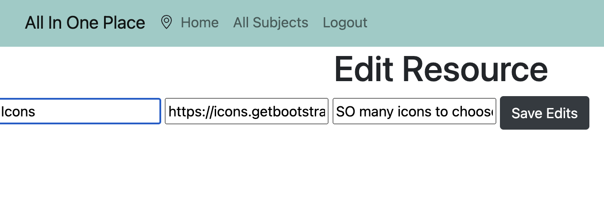

# Project 2: Express CRUD APP
## *All In One Place*
:pencil2: :books: :computer:

### About the App, All In One Place:
As educators around the world shifted to remote learning during COVID-19, multitudes of new online learning technologies and platforms were introduced. Many of us, myself included (as a kindergarten teacher at the time), were learning on the go about these new technologies and learning how exactly to implement them into our daily instruction. Some online platforms were better than others, but regardless, there were multiple of them, and throughout time, it started to become hard to keep track of them all. Sure, our school districts may have had a portal with "all the resources you need" but it became too much to handle. It was a frustrating process to get to all the right online spots we needed throughout our day.

That's when I thought: Wouldn't it be nice to have all of my class's subjects and online learning resources all in one place? This would save a lot of energy and time, and would surely make life easier for all of us. With that said, All In One Place is an app where educators can compile a list of their subjects and online learning resources for their classes. They are the Admin of the App and can add and/or delete subjects, as well as add, edit, or delete a resource for that subject. As a user, all subjects and learning resources are in one place. Simple to bookmark in their browser, then easily maneuver and navigate through. Remote learning is hard enough, especially for our littles, so let's try to make things as simple, clear, and as easy to access as possible!

### ERD

### Wireframe

### Screenshots of App

### Technologies Used
1. Express
2. Node.js, ejs
3. Mongoose & MongoDB
4. OAuth
5. JavaScript
6. HTML
7. CSS
8. Bootstrap

### Next Steps
One thing I'm continually learning is that you are never "done" working with your projects. There's always something more you can do. And just when you **think** you're done, something else pops up. For this project, I would like to find the time to continue styling this app where it actually loooks like a modern-day app anyone would be using and also would **want** to use. I am sure more functionality ideas will pop up too. Maybe an option for the user to rate a resource? I look forward to continue adding more to this as ideas come up.